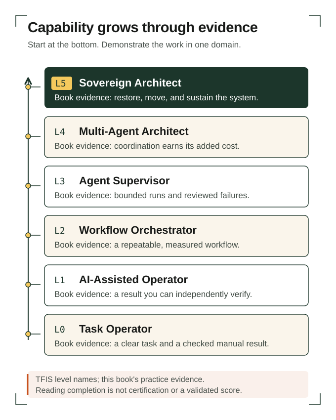

# Chapter 1: The Future Is Solo

*Develop a verifiable starting capability: describe one useful task, establish your own baseline, and test a saved AI prompt across five recorded attempts.*

## A company begins with an unfinished piece of work

Maya opens a blank document and types the name of her proposed business: Fieldwork. She has experience facilitating workshops. She wants to help independent adult educators turn what they know into short workshops that other people can use. She has no customers yet, no evidence that anyone will pay for this particular service, and no software to sell. Fieldwork is an idea with a name.

Maya and her studio are fictional. Their case lets us follow decisions, failures, and repairs closely without mistaking an illustrative business for market evidence.

Her first idea is a generic workshop template. She imagines sections for an introduction, learning objectives, activities, discussion, and a closing reflection. An AI assistant could produce that document quickly. It could also produce a logo, a service description, and several months of promotional posts. By evening she could have the appearance of a functioning business.

Yet one question remains unanswered: what does a particular educator need a learner to be able to do after the workshop? A template can be beautifully organized while offering little help with that decision. Maya has reached a useful starting point. She needs to investigate a piece of work before expanding the business around it.

She names that piece of work `workshop-brief-v1`. It will be a short design brief describing a possible learner, a task the learner might need to perform, the conditions of that task, and an observable result. At first, every claim about the learner is provisional. The brief is an instrument for asking better questions, not a product announcement.

Your starting point should be similarly modest and consequential. Choose one output whose usefulness you can inspect. You need enough familiarity to notice obvious defects, enough uncertainty to learn something, and enough control to repeat the work. The company-sized ambition can remain. Today's evidence will come from a smaller unit.

## What “solo” asks you to own

The Future Is Solo proposes that an individual can organize AI and automation into capabilities previously associated with larger organizations. Its central concern is the person's ability to direct and retain useful capability, rather than the possession of a particular tool. This book treats that proposition as a practical question to investigate. ([The Future Is Solo, n.d.-b](https://thefutureissolo.com/))

Owning direction means being able to say what work is for. Maya must decide whose problem she is trying to understand, what she can responsibly promise, and what would make the result worth paying for. An assistant can draft alternatives and expose inconsistencies. The existence of alternatives does not choose among them.

Owning the consequence is just as concrete. If a workshop brief misrepresents research, the educator receives a misleading brief from Fieldwork. The fact that an assistant supplied the sentence does not improve the educator's position. Maya needs a way to recognize the mistake, correct it, and prevent a repeat. Her role includes setting standards and arranging for the work to meet them.

This kind of independence remains compatible with cooperation. A solo founder can buy services, consult experts, join a professional community, and ask a peer to review an unfamiliar claim. An employed professional can build the same capability inside a team. Independence becomes useful when it creates options and reduces avoidable fragility; it becomes a burden when the owner insists on personally mastering every specialty.

Consider two versions of Maya's day. In the first, she copies text between several tools, re-explains the project at every step, and fixes the same errors repeatedly. In the second, a clear brief guides the work, a saved procedure produces a reviewable draft, and her corrections improve the next attempt. Both days involve one person and AI. Only the second leaves her with something that may make tomorrow easier.

That difference is the subject of this book. Your work should produce durable assets: explanations, procedures, evidence records, tested artifacts, and informed relationships. Their usefulness will guide where you invest time and, eventually, what you offer others.

## What productivity evidence can and cannot promise

There is empirical reason to test AI assistance. In a preregistered experiment involving 453 college-educated professionals completing occupation-specific writing tasks, Noy and Zhang reported that access to ChatGPT reduced average completion time by 40% and increased assessed output quality by 18%. These were measured results in that experimental setting. ([Noy & Zhang, 2023](https://doi.org/10.1126/science.adh2586))

The conditions belong beside the numbers. These results concern professional writing tasks under a particular intervention. They do not establish the ability to replace every company function, customer demand for Maya's offer, her long-term maintenance costs, or the same improvement from an assistant used today.

For Maya, the research justifies a local experiment. It gives her a reason to ask whether assistance changes the time and quality of her brief-writing task. She still needs a baseline, an explicit standard, and a record of what she corrects. Borrowing the study's percentage as a forecast for Fieldwork would bypass the very measurement that made the finding informative.

The same discipline applies to impressive demonstrations. A demonstration can establish that a system completed an example under the shown conditions. You need additional evidence to know how often it works, how failures appear, and how much attention it requires. A smooth recording rarely tells you the cost of all the attempts that preceded it.

Keep three questions separate. Can the tool produce an acceptable result? Can your working process produce that result repeatedly? Can the resulting offer sustain a business? The first concerns an output, the second an operation, and the third an exchange with customers. Progress on one question can help with the others, but cannot answer them automatically.

A local trial can investigate one of these questions without requiring you to settle the entire economic thesis first.

## Put units beside the ambition

“A million-dollar company” is an incomplete description. A business might generate a million dollars in annual revenue, sell for a million dollars, or hold assets valued at that amount. Its owner might receive much less in personal earnings. When you discuss the destination, name the quantity and the period.

For an illustrative annual-revenue scenario in US dollars, suppose a service charges $2,000 per engagement. Reaching $1 million in revenue requires 500 such engagements in a year. Over an assumed 50 working weeks, that is ten engagements each week. If each engagement requires four hours of owner delivery time, delivery alone consumes 40 hours weekly. Selling, administration, revisions, and recovery from mistakes still need time.

These figures are arithmetic, not market evidence or a recommended price. They expose the operating question hidden inside the aspiration. Could a different scope make delivery more repeatable? Would buyers purchase a reusable resource instead? Would a higher price require more individual attention? Each alternative changes what the business must establish.

A hypothetical $200 resource would require 5,000 purchases to produce the same gross revenue. That reduces neither the need to reach buyers nor the work of maintaining an offer that deserves their money. A digital file has a different delivery process from a consulting engagement; the multiplication does not show that demand exists.

Maya does not choose either scenario yet. She writes them in a separate page headed “Illustrative arithmetic—no demand established.” Her immediate project remains a workshop brief. She wants to know whether she can help make an educator's intended learning outcome more precise. Without evidence of usefulness, polishing the revenue model would merely sharpen an assumption.

You can use this simple arithmetic to protect your ambition from vagueness. Work backward from the quantity you mean. Identify the number of transactions, the work required per transaction, and the parts you have never observed. Keep assumptions visible. Later chapters will examine costs, margins, capacity, and demand together; for now, the calculation tells you where a good question is hiding.

## Locate a capability, not an identity

SSA-CMM is the Solo Systems Architect Capability Maturity Model. The current TFIS homepage names six levels: **L0 Task Operator**, **L1 AI-Assisted Operator**, **L2 Workflow Orchestrator**, **L3 Agent Supervisor**, **L4 Multi-Agent Architect**, and **L5 Sovereign Architect**. These are the labels used throughout this book. ([The Future Is Solo, n.d.-b](https://thefutureissolo.com/))

The associated field manual, *The Functional Life*, uses alternative names at several levels: Manual Operator, Tool User, Workflow Builder, and Loop Engineer. Its L4 description emphasizes retaining reviewed judgment through verified feedback. We preserve the main-site labels and disclose the variation; Chapter 23 examines how to read the sources together. ([The Future Is Solo, n.d.-a](https://life.thefutureissolo.com/))

At this point, the practical question is whether you can move one task from manual performance toward reliable AI assistance. You remain responsible for doing and reviewing the work. There is no requirement to appoint agents, connect databases, or automate delivery. Those choices become meaningful when a working task justifies them.

Maya might already be highly capable at facilitating a discussion. That does not tell her how capable she is at building a source-supported research brief with an assistant. A capability statement needs a domain and conditions: “I can turn my own workshop notes into a reviewable design brief, preserving uncertainty and finding missing information.” It is much easier to examine than “I am at Level 1.”

The chapter's checks are book-developed practice criteria, not official certification. Five attempts can reveal what the task requires, where assistance helps, and what needs another trial. They do not award a maturity level.

Your progression can therefore be uneven. You may keep one activity manual because its frequency is low, use an assistant for another, and eventually design a repeatable workflow for a third. The portfolio should describe these differences honestly. An accurate boundary around a capability is part of the capability itself.

*Figure 1. TFIS level names with this book's practice evidence. Open the diagram to view the full-size SVG. The evidence concerns demonstrated work in a domain; reading completion is not certification.*

## A real experiment begins with two sessions

What would independent collaboration between agents look like? In the TFIS experiment deck, “Build W16 Scratchpad” begins with a document template and two manually operated agent sessions. The following experiment adds an interface with several panes for managing the work together. ([The Future Is Solo, 2026, slides 12–13](https://docs.google.com/presentation/d/1dvbBGs22QvtGogevZ6f5mf8YQE7WDAPBwYlclhTyctI/edit#slide=id.g3e6bf19dcd5_0_0))

The deck records these builds, not an independent reliability evaluation. Its question about scaling to 10,000 agents remains a proposed direction. The useful progression is already visible at the smaller scale: curiosity produces an inspectable arrangement, and working with that arrangement raises the next question.

You do not need to reproduce the technical setup. Apply its scale of inquiry to your own task. Before designing an elaborate service, arrange one brief that you can review. Before adding another component, identify the limitation it is meant to address. Let the next construction answer a question left by the previous attempt.

## Record how the work happens today

Before adding assistance, make the current task visible. Choose a representative input and perform the work in the way you normally would. Record when you start, when you stop, what you produce, and what you check. If interruptions occur, note them. You are establishing a useful comparison, not staging a speed contest.

Maya creates a synthetic input for practice: an educator wants to run a short workshop, has several topic ideas, and has not specified what learners should do differently afterward. The input contains no real person's private information. She spends an illustrative 40 minutes drafting a brief. This is a fictional timing record, included to show the method rather than predict your results.

Her first draft names a possible audience, lists questions about the learner's task, distinguishes known details from assumptions, and suggests one observable output. She also records the parts she found difficult. Choosing an observable outcome took longer than arranging the headings. Determining what she did not know required more thought than writing sentences.

This distinction matters when selecting work for assistance. If she measures only typing time, she may optimize the part that was already easiest. Her baseline should include thinking, checking, and repairing. The assistant's draft will need those activities too, even if generation takes seconds.

Write a short description of an unacceptable result before examining the assisted output. For Maya, a brief fails if it invents an interview, treats a proposed audience as confirmed, or calls a list of topics a demonstrated learning outcome. These defects are more important than whether the prose sounds polished.

Keep the manual draft. It gives you a concrete object against which to compare later work and a record of your starting judgment. You may discover that your original method also made unsupported assumptions. The baseline is evidence of the previous process, not a declaration that the previous process was correct.

## Audit repetition before choosing automation

The field manual's opening practice recommends auditing repeated work, selecting a frequent task, and running a saved prompt several times while recording corrections. We will develop that suggestion into a small working experiment. The specific trial count is a starter exercise, not a statistically validated threshold. ([The Future Is Solo, n.d.-a](https://life.thefutureissolo.com/))

Look across a week of work. Describe activities with a verb, an input, and an output: summarize meeting notes into decisions; turn source notes into a brief; compare two versions and identify changes. “Marketing” and “research” are too broad to reveal what repeats. You should be able to recognize another instance when it arrives.

For each candidate, ask what triggers it, how often it occurs, what makes its output useful, and who can judge it. Add the cost of getting it wrong. A task can be frequent yet unsuitable as a first experiment if you cannot inspect the result or undo a mistake.

Maya has no customer-delivery history to audit. She does not invent one. She examines her own preparation practice and notices a recurring activity: converting loosely organized workshop ideas into a short design brief. Her record distinguishes observed repetition in her preparation work from the untested assumption that customers would buy that work.

Then she considers whether the task should happen at all. A beautifully automated weekly report would add little if nobody needs its contents. A better response might be eliminating it, reducing its scope, or replacing it with a short conversation. Tool use should follow the decision about usefulness.

Choose a first task with a modest boundary. It should consume enough repeated effort to matter, but fit inside a result you can read and check. Avoid bundling investigation, sales, delivery, and invoicing into one prompt. If the output fails, you need to know which piece failed and what to change.

A narrow experiment also fits around your other responsibilities. Test a brief during a normal work session, record the result, and return tomorrow with something concrete to compare.

## Turn a request into a saved specification

Maya's first request is ordinary: “Make these notes into a useful workshop brief.” The response has tidy headings and an appealing description. It also states that learners lack confidence and prefer hands-on activities, although neither claim appears in her notes. The assistant has filled gaps she needed to keep visible.

She could remove those sentences and move on. Instead, she asks what instruction would help her recognize and prevent this class of error. The problem is not simply that the tone is too confident. The output has confused proposed explanations with supplied evidence.

Her saved prompt specifies the input boundary: use only the supplied notes for claims about the educator or learners. It specifies the output: a brief containing the proposed learner task, known facts, assumptions, missing information, and a candidate observable result. It specifies a failure response: if a necessary detail is missing, identify the missing detail and write a question rather than supply an answer.

She adds two examples. “Learners will produce a draft checklist” may be a proposed outcome. “Learners improved their performance” requires an observed result. The examples teach the distinction the output must preserve; they do not require the assistant to imitate a particular writing style.

Save the prompt in a file you can reopen. Give it a simple version name and date. Place the input beside it, keeping any private material out of a service you are not authorized to use. The accompanying artifact contains a reusable prompt with blank fields and a fictional worked version. You can paste either into an ordinary chat interface; no programming is required.

Treat the prompt as an initial specification: a statement of what the work should accomplish and the conditions under which you will accept it. It will be incomplete. The next attempts are designed to discover where. Do not demand an elaborate instruction for every possible failure before you have observed a single useful result.

## Learn from five attempts

Maya numbers her trials and records the input, prompt version, output, review verdict, and repair. Her first attempt is the overconfident draft. Its useful discovery is that the input boundary needs to be explicit. She marks the attempt “rewrite” and describes the invented learner claims.

The second attempt uses the same input with the revised prompt. It keeps assumptions separate, but its proposed outcome is “understand the workshop topic.” Maya cannot inspect that outcome directly. She changes the prompt to request something a learner could produce, choose, demonstrate, or explain under stated conditions. Her correction concerns the testability of the brief, not merely its vocabulary.

For the third attempt, she introduces a different synthetic set of notes. The educator lists several possible audiences. The response chooses one without explaining the choice. Maya's review catches a new boundary: the assistant may propose an audience for discussion, but cannot convert that proposal into a confirmed customer definition.

The fourth attempt deliberately contains an important gap. The notes name an audience and topic but contain no description of the task a learner needs to perform. This time the response identifies the gap and asks a focused question. Maya accepts that behavior. Producing less content is useful when it preserves a decision that still requires evidence.

The fifth attempt uses another ordinary input and the latest prompt version. Maya checks whether the earlier corrections still apply. The draft separates assumptions, proposes an inspectable learner output, and leaves unresolved audience choices visible. She accepts it after a small wording edit. The five attempts have given her a more precise specification, not proof that every future brief will pass.

Notice that the trials serve different purposes. Reusing an input helps examine a repair. Changing the input helps reveal whether the repair was too specific. Supplying a missing detail deliberately tests how the procedure behaves at a boundary. Five copies of the same successful exchange would have taught her less about the task's range.

Her log also preserves failures. Deleting them would make the current prompt harder to understand. A later version might accidentally restore the instruction that encouraged an unsupported choice. With the history available, she can explain why a requirement exists and construct a quick check for regression—a return of a previously fixed defect.

Do not manufacture a failure just to satisfy the exercise. If your first attempts all look acceptable, make the review more searching or try a genuinely different input. Record what you inspected. A result that survived a meaningful challenge carries more information than a favorable impression.

## Count the work around the answer

Suppose Maya's final assisted attempt takes an illustrative 22 minutes: three preparing the input, one waiting for the draft, ten checking it, and eight revising and filing it. Subtracting that from the fictional 40-minute manual baseline gives an 18-minute difference in recorded durations. The attempts used different inputs, so the difference is not yet an estimate of time saved by assistance. The fifth input might simply have been easier.

She also spent time developing the prompt and reviewing the earlier failures. Suppose that setup took 90 minutes. Under the simplified assumption that future comparable attempts save 18 minutes each, five such attempts would recover the setup time. If later inputs require longer review or the task changes, the calculation changes too. These invented numbers show which costs to track.

A useful timing comparison needs its own trial. Maya can choose comparable inputs and the same acceptance criteria, record the full manual and assisted work, and note that seeing an input previously may make a later attempt easier. Across further trials she can vary which method comes first. The exploratory five attempts were designed to discover defects; this comparison investigates effort under a defined quality bar. If the assisted version leaves errors behind, a shorter duration may simply defer repair.

There are useful outcomes besides speed. A clearer brief may expose a question sooner. A consistent output format may make peer review easier. Keeping the record might reduce repeated explanation next week. Describe these benefits concretely, and test them when they matter. Avoid collecting every possible benefit in a vague claim of greater productivity.

The result may also justify staying manual. If the task occurs twice a year and requires extensive correction, maintaining a prompt may cost more than it saves. Choosing that boundary is competent system design. You are trying to improve the work you actually have, not maximize the amount of work labeled automated.

## Keep a part of the task inside your own understanding

Close the assistant and the draft. In ordinary language, explain what a useful workshop brief does, name two ways a polished brief can fail, and describe which unanswered question matters most in the current project. Maya should be able to do this without reproducing the assistant's wording.

This is a thinking check, not a memory performance. She may consult the documents afterward to correct details. What matters now is whether she can exercise the judgment her prompt requires. If she cannot explain why an outcome is observable, adding that phrase to an instruction has not yet given her the ability to evaluate the response.

When the explanation breaks down, record the gap. “I cannot distinguish a topic from a task learners can perform” is a useful next learning objective. She can study an example, make her own contrast, and ask a knowledgeable person to challenge it. The assistant can help prepare that work while Maya remains responsible for understanding the distinction.

This practice becomes more important as the system becomes more capable. You do not need to hold every fact in your head. You do need enough understanding to recognize when the process is operating outside its limits, and enough curiosity to investigate when its confident answer does not fit the situation.

## Make the experiment fit your work

A service professional might begin with a meeting-to-decisions brief. The critical check is whether the draft distinguishes an agreed commitment from a suggestion. Use fabricated notes until the process and data permissions are clear. The first useful improvement may be a visible list of unresolved decisions rather than a shorter summary.

An educator might turn their own lesson notes into a practice activity. The output must give learners an opportunity to do something and give the educator a way to inspect the attempt. A fluent explanation of the topic does not establish either condition. Keep the exercise small enough to review with your existing subject expertise.

A software builder might describe a proposed feature in user language before generating code. The first artifact can list the input, expected behavior, failure conditions, and what remains outside scope. If you do not code, you can still inspect whether the description answers those questions. Implementation can wait until the behavior is understandable.

Each adaptation starts with one task and one acceptance standard. Your domain will determine the important defects. Copying Maya's workshop categories without adapting them would preserve the form of the exercise while losing its purpose.

## Field assignment: leave evidence for the next chapter

Complete the [capability baseline](../artifacts/01-capability-baseline.md) with a task from your own work. It includes the weekly audit, manual baseline, saved-prompt fields, five-run correction log, and a worked Fieldwork example. Keep all five outputs, including the ones you reject.

Your artifact is ready when another reader can inspect the task, inputs, outputs, and acceptance criteria; trace a revision to an observed result; and identify what still needs testing.

If you have no repeated task, use a small practice task and label it as practice. If you cannot judge the output, narrow the task or arrange informed review. If the assistant keeps inventing missing information, reduce the input set and test that boundary directly. The repair should address the observed defect.

Maya ends the exercise with a provisional brief, a prompt she can reuse, and a record of what she corrected. She still has no evidence that an educator wants to buy the service. She does have a more precise question about usefulness: what claim would support choosing this learner task, and how could she check it? That question opens [Chapter 2](02-the-end-of-knowledge-scarcity.md).

## References

Noy, S., & Zhang, W. (2023). Experimental evidence on the productivity effects of generative artificial intelligence. *Science, 381*(6654), 187–192. https://doi.org/10.1126/science.adh2586

The Future Is Solo. (n.d.-a). *The functional life* (Field Manual No. 01). Retrieved September 10, 2026, from https://life.thefutureissolo.com/

The Future Is Solo. (n.d.-b). *The future is solo*. Retrieved September 10, 2026, from https://thefutureissolo.com/

The Future Is Solo. (2026). *The Future Is Solo 20260910* [Google Slides presentation]. https://docs.google.com/presentation/d/1dvbBGs22QvtGogevZ6f5mf8YQE7WDAPBwYlclhTyctI/edit

<!-- sources: noy2023, TFIS-LIFE, TFIS-HOME, tfis-experiments-20260910 -->
