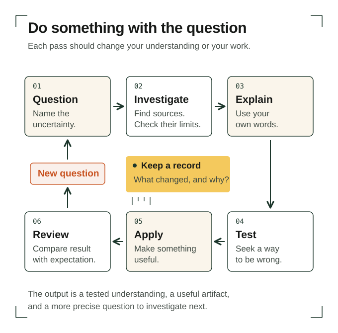

# Chapter 7: The Accumulated Curiosity Loop

*Connect an inquiry, explanation, test, application, and review into a repeatable working procedure, then show that a later attempt actually uses an earlier correction.*

## The second attempt should begin somewhere different

Maya's practice folder contains several useful records. She has a capability baseline, a claim-evidence ledger, a curiosity map, an inquiry brief, a concept deconstruction, and a connection map. Each helped improve the fictional Fieldwork workshop brief. Each also contains a lesson she could easily forget to use.

When she opens a new chat, she pastes an older version of her drafting prompt. The response again treats every action as if it should have a named owner. She notices the problem because Chapter 6's review exercise made it familiar. Yet noticing it again is not the same as having prevented it. The correction existed in a document that this attempt never used.

The example exposes a practical question: how will the next piece of work benefit from the previous one? Maya cannot answer by counting saved files. She needs to show where an inquiry changes a working instruction, how the changed instruction reaches the next attempt, and what result demonstrates that the change helped.

This chapter connects the Mind arc's activities into one procedure that Maya can direct, inspect, and repeat with assistance.

The thirty-minute action-list workshop remains a synthetic design example. The growing collection documents Maya's design practice; learner and customer outcomes still await investigation.

Bring your earlier artifacts to the assignment. You will use their relationships, rather than create another collection beside them.

## Follow a complete pass through the work

The loop begins with an uncertainty that matters to a decision. Investigation gathers relevant evidence. Explanation makes your current understanding available for inspection. A test gives that understanding a chance to fail. Application changes something useful. Review compares what happened with what you expected and identifies the next question.

*Figure 7.1. Curiosity compounds when a pass produces checked understanding, a useful artifact, and a more precise next question. This is the book's working procedure, not a validated maturity scale.*

Read the diagram clockwise: name the uncertainty, investigate it, explain the idea in your own words, test a possible mistake, apply what survives, and review the result. The central record preserves what changed and why. Real work may return to an earlier step when a test exposes a poorly framed question or a missing source.

You do not need to force every investigation through a ritual. Some questions require a quick lookup; others require a conversation or a substantial experiment. Use the complete pass when the result is important enough to influence repeated work. The purpose is to avoid stopping at the point where the answer merely sounds satisfying.

Maya's earlier chapters already performed parts of this procedure. She questioned an output, checked a claim, clarified a concept, and tested an analogy. The new capability is to make the connection between those activities explicit enough to repeat on another input.

“Accumulated” refers to a change in the starting conditions of later work. A corrected requirement is available before the next draft. A rejected claim stays rejected unless new evidence justifies reconsideration. A useful test is ready when a familiar defect could recur. These effects must be observed; saving the record alone does not establish them.

## Choose a question that can change the current procedure

Maya's new question is narrow: can she draft an example action list for the brief that preserves an agreed action with missing ownership, without relying on information left in an earlier chat? The answer matters because she wants a drafting process she can restart from its saved materials.

She states what would count as a useful result. The new attempt should read the current instruction, represent the missing assignment honestly, and preserve the distinction between an agreement and a suggestion. The output should also give her enough evidence to review those judgments against the input.

The trial examines whether a specific correction reaches a fresh attempt and changes its behavior on the supplied case. General reliability, autonomous delivery, and learner outcomes remain outside its scope.

Your question may concern a different failure: a source gets lost during summarization, a draft omits a requirement, or an assistant repeatedly treats a plan as an observation. Write the question in terms of the operation you can inspect. “How do I build a smarter system?” leaves too many possible explanations open.

Choose a stopping point before beginning. Maya will stop this pass when she has a current instruction, a reviewed attempt, and a record of the result or the unresolved defect. If the result is inconclusive, the pass can still end with a precise next test. Continuing to ask for more drafts without changing the investigation would only make the evidence harder to interpret.

Protect a place for questions that do not serve the current decision. Maya can keep an idea for a different workshop in her curiosity map. She does not need to pursue it while repairing this workflow. Curiosity gains practical freedom when you can preserve a question without immediately spending the time to answer it.

## Investigate what is actually missing

Before searching for new knowledge, inspect the evidence you already have. Maya compares the old prompt, the connection map, and the latest review sheet. The old prompt asks for complete action details. The review sheet permits an honest missing-owner flag. The documents disagree.

This is a useful diagnosis because it changes the next action. She does not need a better model or a more elaborate explanation of learning. She needs to reconcile the instruction with the reviewed decision and ensure the next attempt receives it.

Her source records remain relevant. The claim-evidence ledger explains why a research finding does not establish demand. The connection map explains why exact wording and field completeness are inadequate review criteria. She checks the specific entries needed for this pass rather than pasting the entire folder into the conversation.

If a necessary claim is still unsupported, the investigation expands only as far as the decision requires. She may need to open the relevant source or consult a knowledgeable reviewer. The evidence field in the loop record should say what she inspected and at what depth. It should also preserve uncertainty that the investigation did not resolve.

Avoid using a new search as a substitute for diagnosis. A long answer about agent memory will not explain which version of the prompt Maya pasted. A discussion of instructional design will not settle whether her saved criteria contradict each other. Begin with the smallest observable mismatch, then broaden the investigation if the local evidence cannot explain it.

The record lets another person challenge the diagnosis. In a real project, “wrong prompt version used” needs support from the actual attempt's inputs; the final output alone cannot establish its cause.

## Explain the intended change before making it

Maya closes the files and writes a short account of the desired behavior. An action can be agreed while some details remain unsettled. The brief should preserve both facts: the agreement exists, and the assignment may be incomplete. A suggestion should not become an agreed action merely because assigning it would make the list look useful.

She also explains the operational repair. One current instruction must contain this distinction. A new attempt must receive that instruction with the relevant input. The review must compare the output with the notes, and the record must identify which instruction version was used.

This explanation exposes two separate requirements. One concerns the meaning of the output. The other concerns how the work obtains the rule it should follow. If she repairs only the prose of the example answer, the next attempt may still use the obsolete instruction.

Give your own explanation enough detail to make a prediction. “The workflow will remember better” does not tell you what to inspect. “The next draft will leave the owner unresolved when the notes contain an agreement but no assignment” does. The narrower prediction also makes a failure easier to diagnose.

An assistant can examine your explanation after you write it. Ask for a missing step or a condition under which the proposed repair would fail. Keep the critique tied to the task. You want a challenge you can investigate, not an expanding list of generic improvements.

If you cannot explain the change without reading the assistant's response, return to the concept-deconstruction practice. You may be able to follow a procedure with external help while still lacking the judgment needed to revise it. The loop should develop both the working artifact and your ability to understand its limits.

## Design a test with a visible result

Maya prepares a fresh practice conversation using the revised instruction and a short set of synthetic notes. She avoids carrying over earlier answers. This removes one source of hidden assistance: a result that depends on corrections still present in the old chat rather than in the saved procedure.

The notes include a clear commitment, a suggestion, and an agreed action without an owner. She requests an action list with unresolved details and references to supporting lines so she can compare it directly with the notes.

She writes the expected properties before running the test. The explicit commitment should appear with its supplied details. The suggestion should remain a proposal. The unassigned agreement should appear with the missing owner flagged. No owner or deadline should be invented to complete the table.

The first fresh attempt in the fictional example preserves the owner gap but silently supplies a deadline for the suggested venue inquiry. Maya rejects that part. The outcome is informative: repairing one recurrent error did not establish the broader behavior she needed. She compares the supplied instruction with the review sheet. Her partial migration restored the missing-owner rule but left an older instruction to propose practical deadlines. The conflict is visible in the supplied text; the output alone would not have established its cause.

She removes the conflicting deadline instruction and restores the evidence boundary already accepted in Chapters 4 and 6. The repair concerns how an existing decision reached the working document. She records the failed output rather than replacing it with the repaired one. The [two-pass practice packet](../artifacts/07-two-pass-practice-packet.md) supplies the instruction versions, literal notes, constructed outputs, and linked review so you can inspect this diagnosis yourself.

Then she repeats the case to examine the repair and uses a changed case to challenge it. The changed notes mention a deadline only as “soon.” A faithful output can preserve that wording or flag that a precise date is unspecified. It should not turn the phrase into a calendar date without authorization.

Suppose the revised attempt behaves as expected. Maya records a bounded pass: the current instruction handled the tested ownership and deadline cases under human review. She does not write “uncertainty problem solved.” The next input could reveal a new ambiguity, and real meeting records may require context her synthetic examples do not contain.

The test leaves a changed instruction, inspected field behavior, and examples that future revisions must still handle. It also sharpens the next question about which information should remain unresolved.

## Apply the finding where the work begins

A finding becomes operational when it changes the material that directs later work. Maya updates the saved drafting instruction and the review sheet. She checks that the two documents agree. She also revises the relevant part of `workshop-brief-v1` so that the proposed learner activity and the review criteria preserve the same distinction.

Keep research conclusions, operating instructions, and example outputs separate enough that each can be maintained. The ledger records the support for a claim. The instruction tells the next attempt what to do. The example demonstrates how the requirement looks in one case. Combining all three into a single undifferentiated paragraph makes later updates harder to judge.

Maya gives the current procedure a version and a date. Earlier drafts remain identifiable, but there is one clear entry point for the next pass. The specific filename is a convenience; what matters is that she can tell which version should be used and what changed since the previous one.

She reopens the saved instruction after editing it. In a real workflow, this check confirms that the intended change exists in the file rather than only in the conversation. She then starts the next attempt from that file. A claim that the procedure was updated and an observed update are different pieces of evidence.

The TFIS experiment “Build W15 #2 DevOps Skills” takes up a similar continuity problem: continue from earlier sessions and maintain a change log. The deck describes separate development, staging, and production areas. It records the practice without independently verifying the current deployment. ([The Future Is Solo, 2026, slide 10](https://docs.google.com/presentation/d/1dvbBGs22QvtGogevZ6f5mf8YQE7WDAPBwYlclhTyctI/edit#slide=id.g38b5682a36f_0_44))

For an opening no-code workflow, the transferable idea is modest: retain what changed and provide a place to inspect a draft before relying on it. Maya does not need the technical infrastructure from the slide. A saved instruction, a practice copy, and a reviewed current version are enough to begin.

## Write a review that the next pass can use

Maya's review records the expectation, the observation, the verdict, the reason, and the resulting change. “The answer was better” would fail to preserve the lesson. “The revised instruction kept an unstated owner unresolved but still invented a deadline; inspection found an old deadline instruction still active, so the next version restores the already-accepted evidence requirement for both fields” gives the next attempt something concrete to use.

She links the statement to the relevant output. This matters because her explanation of the failure could itself be wrong. Perhaps a deadline was present in an input she overlooked. Perhaps she used the wrong prompt version again. The review should be open to correction when the evidence warrants it.

*The Functional Life* emphasizes capturing judgment and checking durable writes. In this chapter, those ideas become a small human-maintained record that will guide the next run. Agent feedback and oversight require additional controls developed later in the book. ([The Future Is Solo, n.d.-a](https://life.thefutureissolo.com/))

Keep the review's conclusion attached to the tested behavior. Maya's repair supports the next drafting attempt, while the ledger retains the open learner and market questions.

Choose a next question that follows from the result. Maya might ask whether her instructions handle contradictory notes, rather than immediately launching a broader product. If contradictions matter to the intended service, that is a worthwhile next inquiry. If they are outside the first offer's scope, she can define an escalation path and defer deeper automation.

The review should leave you with a decision rather than only a description. Keep the revised procedure, return to an earlier version, narrow the supported input, or stop the experiment. Each is a legitimate outcome when it follows from the observed work.

## Make the next run read the correction

The strongest check on accumulation is another attempt that begins from the saved record. Maya opens her loop record, follows its current-version pointer, and loads the relevant instructions. Before asking for a draft, she identifies the correction that this run is supposed to use.

She does not paste every past conversation into the new one. She supplies the current task, necessary input, accepted requirements, and a small set of relevant examples. The rejected rules remain in the history with their reasons, but they are not presented as current instructions.

This separation prevents a familiar source of confusion: an old recommendation and its later correction can both appear in a long record without a clear indication of which one governs. Maya's entry point states the current rule directly and links to the history for explanation.

The next output is checked against a changed input. If it preserves the correction, she has evidence of reuse under those conditions. If it repeats the earlier mistake, she investigates whether the right instruction was received, whether the instruction was clear, and whether the case exceeded the tested scope.

Do not solve every failure by adding more text. A conflicting example may need removal from the active instruction. A vague requirement may need a clearer statement. A task may need to be divided so that source extraction can be inspected before interpretation. The repair should follow the diagnosis.

Maya is still directing these operations herself. That is appropriate for the present stage. The emerging asset is a repeatable procedure she can explain and inspect. Its dependence on her judgment is visible, so she can later decide which parts are suitable for delegation and which should remain hers.

## From a successful prompt to a repeatable workflow

The current TFIS homepage describes L1 as AI-Assisted Operator and L2 as Workflow Orchestrator. The practical distinction is useful here: one assisted answer becomes more repeatable when its inputs, steps, outputs, and review conditions are explicit enough to use again. The book's evidence checks interpret the model; they do not certify a level. ([The Future Is Solo, n.d.-b](https://thefutureissolo.com/))

Maya writes a short procedure. First identify the inquiry and the decision. Then gather only the relevant records and evidence. Explain the intended behavior, produce or revise the artifact, inspect it against the criteria, and save the verdict and next action. She keeps human review at the points where meaning and support must be judged.

A procedure becomes testable when its steps have clear handoffs. The investigation produces a source record or an explicit statement of missing evidence. The drafting step receives the current requirements. The review receives the input and output together. The final update produces a current artifact and a traceable change note.

Try following your procedure after an interruption. If a step depends on remembering an unnamed conversation, make that dependency explicit. If the output of one step is insufficient for the next, revise the handoff. A workflow diagram that hides these gaps will not make the work repeatable.

You can begin with a manual checklist and ordinary files. Automating transfers before the handoffs are clear would make it harder to determine where a failure originates. Once the procedure works, repeated copying or formatting may become candidates for simple automation.

Later chapters develop L4 feedback and oversight through durable judgments, verified writes, and explicit contracts. For now, the demonstrated capability is a procedure Maya runs and reviews herself.

## Choose a rhythm that fits the work

A useful procedure needs occasions to run. Attach it to a recurring piece of work or an explicit review point. Maya could use it when a draft fails an important requirement, when a new input type appears, or before adopting a change that affects repeated delivery. She does not need to turn every interesting thought into a formal record.

Separate the learning session from the later reattempt. Research reviewed by Dunlosky and colleagues supports practice testing and distributed practice across the conditions their review assessed. It does not prescribe one optimal interval for Maya's project or validate the exact schedule in this book. ([Dunlosky et al., 2013](https://doi.org/10.1177/1529100612453266))

A practical adaptation is to revisit a consequential idea after some time has passed, attempt an explanation without reopening the answer, and apply it to a new example. Choose an interval that fits the work. Record whether you could still make the relevant distinction, and use a difficulty as a cue for further practice rather than as a personal grade.

Also bound the production of new questions. An investigation may expose several interesting directions. Select the one that most affects the current decision and leave the others in the curiosity map. Otherwise each completed pass could expand the project faster than you can review it.

The capacity example from Chapter 5 still applies. If you generate more candidate changes than you can inspect, you have created a queue rather than accumulated capability. Reduce the number of open changes or make the review more focused. A modest procedure used consistently can be more useful than an elaborate one you cannot maintain.

Close a question when the evidence supports the next bounded decision. If the proposed change adds no useful value, retain the simpler process and record why.

## Notice incomplete loops

An inquiry can stop at several seductive points. A clear explanation can feel like completion even when no one has tried the task. A successful test can remain a detached demonstration if the working instruction never changes. A careful correction can disappear from future behavior if the next run does not read it.

Look at the artifact your latest session produced. If it is only a summary, identify the decision it informs. If it is only a polished output, ask what you learned about the procedure. If it is only a lesson, find where that lesson changes the next attempt. These questions locate the unfinished connection.

Another failure is a loop that reinforces its own assumptions. Maya could ask an assistant to generate a brief, ask the same assistant whether the brief is good, and retain the favorable review without checking the input. The record would be complete in appearance while lacking an independent examination of the important claim.

Independence here can be simple. Compare the deadline with the actual notes. Open the cited passage. Attempt the task without the model answer. Invite an informed person to examine an ambiguous judgment. Choose evidence that could reveal a mistake instead of merely requesting another expression of confidence.

The opposite failure is over-documentation. If maintaining the record consumes the entire session, reduce it to the question, relevant evidence, tested change, verdict, and next action. Keep links to the underlying artifacts so the short record remains checkable. Completeness of paperwork is not the outcome you are trying to improve.

## Carry the procedure into another setting

For a service professional, a loop might begin with a proposal that repeatedly creates scope confusion. Investigate the actual wording and questions, explain the ambiguity, test a revised description, apply it to the next authorized proposal, and review whether the same confusion recurs. Keep invented examples separate from real client observations.

For an educator, begin with a mismatch between the intended learner task and the activity. Use a design trial to repair the mismatch, then distinguish that trial from evidence about real learners. When learner evidence becomes available, allow it to revise the design rather than merely confirm the preferred method.

For a software builder, begin with a reproducible defect or an uncertain requirement. State the expected behavior, build a check, make the change, and inspect the actual output. Preserve the failing case so a later revision can be checked against it. The change should remain understandable to the person responsible for its consequences.

The shared operation is the return path from evidence to future work. The forms can differ. A diagram, annotated document, or simple table may be enough. Keep the procedure proportionate to the complexity and consequences of the task.

## Field assignment: complete two connected passes

Use the [learning-loop record](../artifacts/07-learning-loop.md) for one consequential uncertainty in your current project. Link the earlier artifacts that matter. Write an explanation before seeking assistance, perform a check that could expose an error, apply the result to a working artifact, and record the verdict with its evidence.

Then complete a second pass using a changed input or a new instance of the task. Begin from the saved current materials. Identify which correction from the first pass should affect the second, and inspect whether it actually does. A second pass that repeats the original mistake is still useful if you diagnose the broken handoff.

Your record is ready when another reader can trace the question through evidence and a decision to the next attempt, identifying each participant's work and any unresolved dependency.

If a connection is missing, repair it directly. An unused finding needs a place in the working instruction. A vague verdict needs an observable reason. A repeated error needs a check of the input, version, and requirement before another layer of automation. A question unrelated to the project can return to the curiosity map.

Maya now has more than a set of interesting conversations. She has a provisional brief and a repeatable way to improve it, with evidence of how a correction reaches a later attempt. The next problem is preserving that usefulness over time. [Chapter 8](08-the-second-brain-is-not-enough.md) begins the Memory arc by examining what should be kept, what can be discarded, and how a stored record becomes available when the work needs it.

## References

Dunlosky, J., Rawson, K. A., Marsh, E. J., Nathan, M. J., & Willingham, D. T. (2013). Improving students’ learning with effective learning techniques: Promising directions from cognitive and educational psychology. *Psychological Science in the Public Interest, 14*(1), 4–58. https://doi.org/10.1177/1529100612453266

The Future Is Solo. (n.d.-a). *The functional life* (Field Manual No. 01). Retrieved September 10, 2026, from https://life.thefutureissolo.com/

The Future Is Solo. (n.d.-b). *The future is solo*. Retrieved September 10, 2026, from https://thefutureissolo.com/

The Future Is Solo. (2026). *The Future Is Solo 20260910* [Google Slides presentation]. https://docs.google.com/presentation/d/1dvbBGs22QvtGogevZ6f5mf8YQE7WDAPBwYlclhTyctI/edit

<!-- sources: dunlosky2013, TFIS-LIFE, TFIS-HOME, tfis-experiments-20260910 -->
